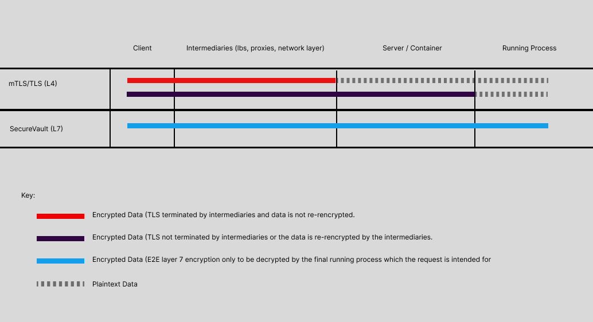

# SecureVault

**End-to-End Application Layer Encryption for Secure Communication**

SecureVault is an open-source security middleware that provides a comprehensive solution for securing web applications. It seamlessly integrates with existing frameworks and complements security measures like TLS or mTLS to add an additional layer of protection. SecureVault ensures that sensitive data is encrypted end-to-end from the client to the application process.

## Why Use SecureVault?

While traditional tools like TLS or mTLS provide robust encryption at the transport layer (load balancers, proxies, etc.), they do not protect data once it reaches the application process. SecureVault ensures that data remains encrypted at all stages, protecting sensitive information from internal threats and ensuring the security of applications in high-security environments like banking, healthcare, government, etc.



## Key Features

- **End-to-End Encryption**: Encrypts data between the client and the application process, ensuring that sensitive data remains protected even after passing through internal infrastructure.
- **Bot Detection**: Detect and prevent malicious bot activity using machine learning-based detection with configurable thresholds.
- **Device Fingerprinting**: Securely associate requests with specific devices using unique device identifiers, with options for device locking.
- **Cryptographic Challenge-Response**: Enhance authentication with a secure challenge-response mechanism that uses public key encryption and automatic key rotation.
- **Cross-Platform Support**: Works with backend frameworks like Django, .NET Core, Express, and frontend interceptors for libraries like Axios, ApiSauce, and the Fetch API.

## Who Should Use SecureVault?

- **Banks, Healthcare, and Sensitive Apps**: If you're building applications that need to secure sensitive user data, SecureVault helps ensure the data remains encrypted even after it leaves the transport layer.
- **Developers Looking to Enhance Security**: If you want to add additional layers of security on top of existing infrastructure like TLS, SecureVault offers seamless integration and an easy-to-use API.
- **Teams with Strict Compliance Needs**: SecureVault provides cryptographic mechanisms and detailed logging to meet the high security and compliance requirements for regulated industries.

## Who Should Not Use SecureVault?

- **Non-Sensitive Applications**: If your application doesn’t handle sensitive user data or if you already have comprehensive security measures in place (like TLS with mTLS), SecureVault may be overkill.
- **Small Scale or Low-Security Projects**: If you're building a low-risk, low-complexity application, you might not need the extra overhead SecureVault introduces.

## Supported Platforms

### Backends

- **Django (Python)**
- **.NET Core (C#)**
- **Express/Nest.js (Node.js)**

### Frontend Interceptors

- [Axios](/docs/interceptors/axios.md)
- [ApiSauce](/docs/interceptors/apisauce.md)
- [Fetch API](/docs/interceptors/fetch.md)
- [GraphQL Clients](/docs/interceptors/graphql.md)

## Installation

### Django (Python)
```bash
pip install django-securevault
```

### .NET Core
```bash
dotnet add package SecureVault.Core
```

### Node.js
```bash
npm install secure-vault-js
```

## Frontend Configuration (Axios)

```javascript
import SecureVault from 'secure-vault-axios';

SecureVault.configure({
  mode: 'strict',
  bot_detection: true,
  device_fingerprint: true,
  challenge_response: {
    public_key: 'YOUR_SERVER_PUBLIC_KEY'
  }
});

const securedAxios = SecureVault.create({
  baseURL: 'https://api.yourserver.com'
});
```

## Backend Configuration

### Django

```python
# settings.py
SECUREVAULT = {
    'BOT_DETECTION': True,
    'DEVICE_FINGERPRINT': {
        'LOCK_TO_DEVICE': True
    },
    'CHALLENGE_RESPONSE': {
        'KEY_ROTATION_INTERVAL': '1h'
    }
}
```

### .NET Core

```csharp
// appsettings.json
{
  "SecureVault": {
    "BotDetection": true,
    "DeviceFingerprint": {
      "LockToDevice": true
    },
    "ChallengeResponse": {
      "KeyRotationInterval": "1h"
    }
  }
}
```

### Node.js

```javascript
// config.js
module.exports = {
  securevault: {
    botDetection: true,
    deviceFingerprint: {
      lockToDevice: true
    },
    challengeResponse: {
      keyRotationInterval: '1h'
    }
  }
}
```

## Security Features

### Bot Detection
- Machine learning-based detection
- Configurable threshold
- Optional request blocking

### Device Fingerprinting
- Unique device identification
- Optional device locking
- Configurable device change limits

### Cryptographic Challenge-Response
- Public key encryption
- Automatic key rotation
- Request-level security

## Additional Interceptor Integrations

Explore detailed guides for other HTTP libraries:
- [Axios Documentation](/docs/interceptors/axios.md)
- [ApiSauce Documentation](/docs/interceptors/apisauce.md)
- [Fetch API Documentation](/docs/interceptors/fetch.md)
- [GraphQL Clients Documentation](/docs/interceptors/graphql.md)

## Contributing

1. Fork the repository
2. Create your feature branch
3. Commit your changes
4. Push to the branch
5. Create a new Pull Request

Please refer to our [CONTRIBUTING.md](CONTRIBUTING.md) for more detailed instructions on how to contribute to the project.

## License

SecureVault is released under the [MIT License](LICENSE).
